# Gavin's Todolist

A to-do list for Gavin (and friends), **built into Whats Up** (Apa yang Diatas). It has tasks, lists, a calendar and stats, changes sync live across every device, and WhatsApp Buddy 🤖 reminds you on your real WhatsApp. Same account, same site: press ✓ in Whats Up.

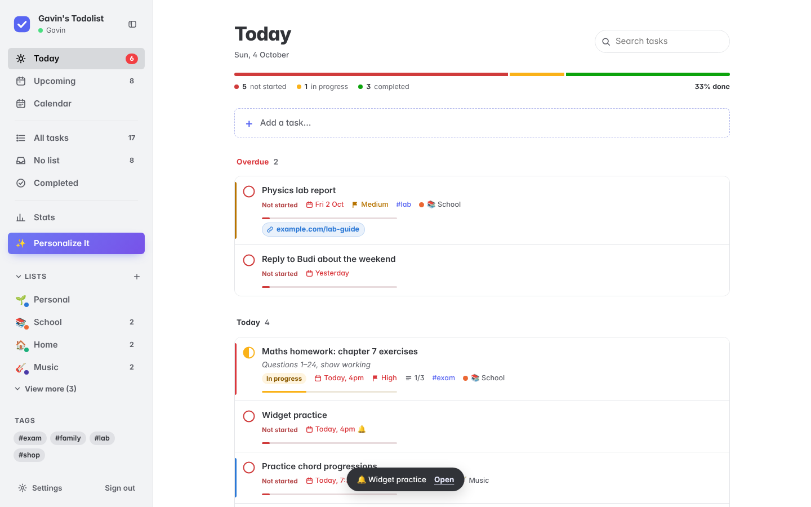

| Personalize It | Blocks checklist | Tutorial | Phone |
| --- | --- | --- | --- |
| 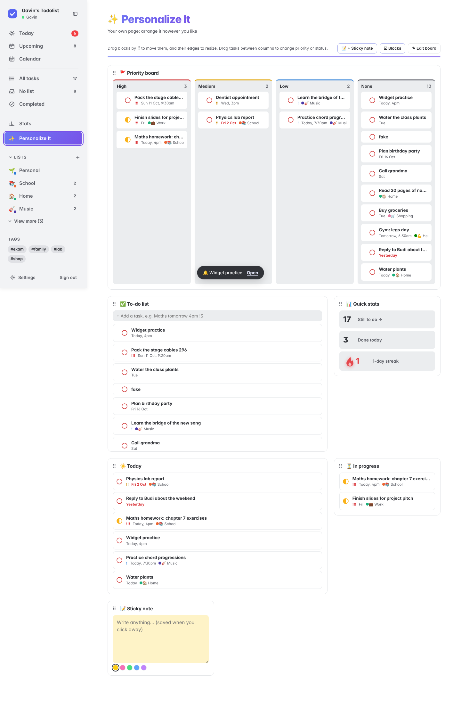 | 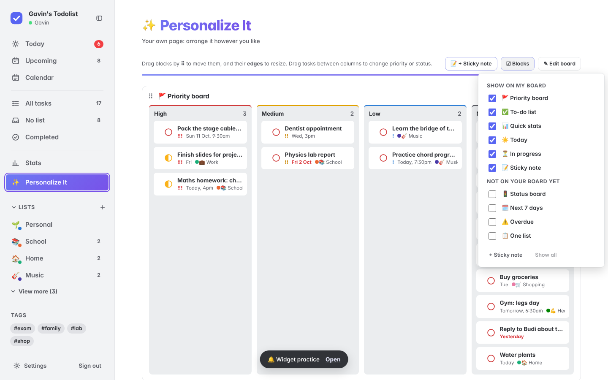 | 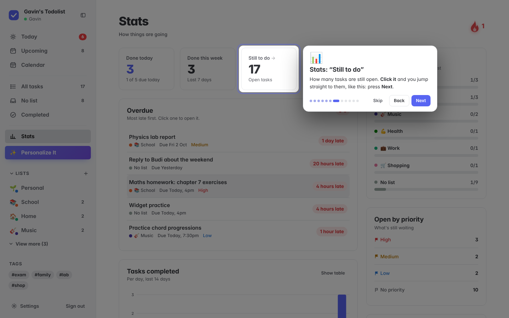 | 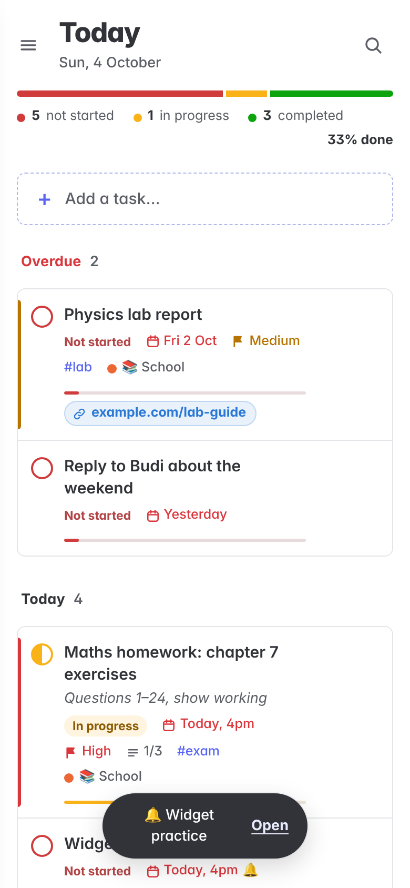 |

| Calendar | Stats | Admin: give people tasks |
| --- | --- | --- |
| 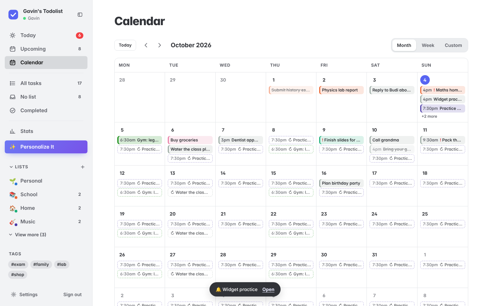 | 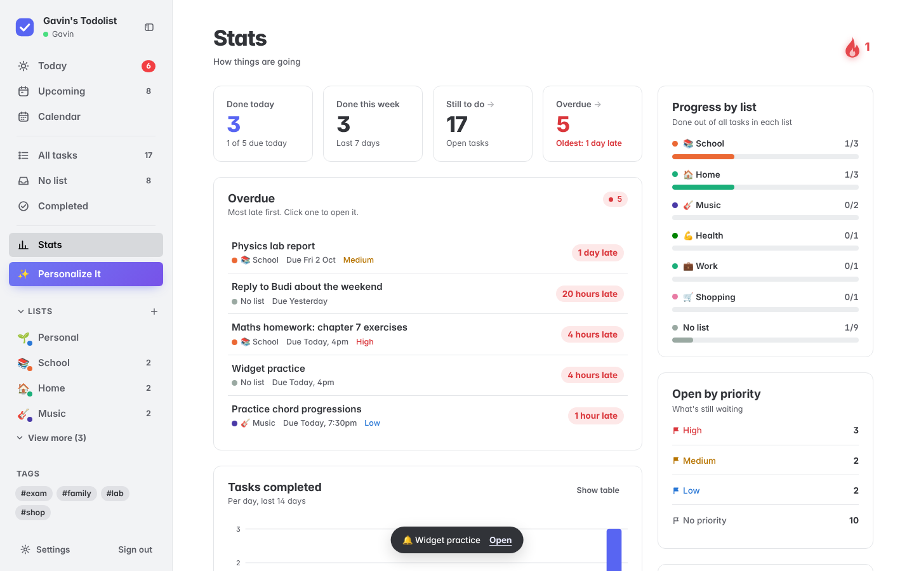 | 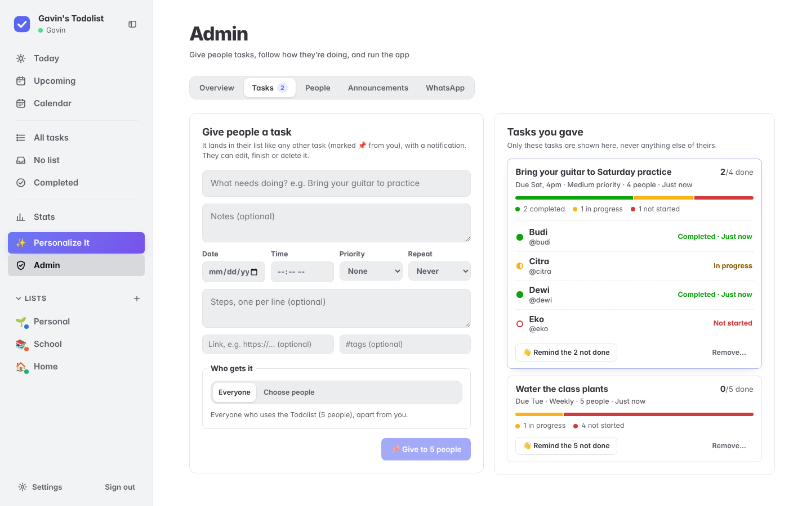 |

---

## What's in it (v2.2)

**New in 2.2**
- **Groups**: a shared task list for a few people (a project, a household). Give a task to someone or leave it open; see who ticked what. Your own list stays private.
- **Calendar link**: Settings → Calendar. Subscribe to it from your phone's calendar and your dated tasks show up there, with their reminders.
- **Tasks from WhatsApp messages**: they show 💬 who it came from, and "Open chat" takes you back to it.
- Buddy: **Long** or **Short**, nothing else.

**New in 2.0: one app with Whats Up**
- The Todolist is part of Whats Up now: the ✓ button opens it, the 💬 Whats Up button on phones goes back to chats, and <kbd>T</kbd> still swaps views. No second website, no second sign-in, no `LINK_KEY`.
- **WhatsApp Buddy writes from a real WhatsApp number** the admin picks, to everyone's own WhatsApp, and people simply reply `done`, `snooze 1h`, `today` or `add …` in that chat.
- The Todolist admin is a tab on Whats Up's admin page.

**New in 1.11: Gavin's Todolist, and WhatsApp Buddy 🤖**
- **It's Gavin's Todolist now**: the name in the app, the sign-in page, the browser tab, the installed-app name and notifications. (If your Railway service has a `BRAND` variable, change or delete it too: it names the app in WhatsApp messages.)
- **🤖 WhatsApp Buddy**: a little reminder bot in your WhatsApp, Long or Short. See [WhatsApp Buddy](#whatsapp-buddy-) below
  - **💬 WhatsApp me** on any task (the chip when adding or editing, or the details panel): at due time, 15 min / 1 hour / 1 day before, in 1 hour, this evening, tomorrow morning, or any date and time. The task shows when, then **Sent ✓**
  - Buddy's message says how long until it's due (or how late it is), its priority, your next step and the first line of its notes
  - **Answer Buddy in WhatsApp**: `td done`, `td start`, `td snooze 30m` (or 2h, tonight, tomorrow, 3pm), `td step` (ticks the next step), `td move` (today's leftovers to tomorrow), `td help`. You can also `td tomorrow`, `td upcoming`, `td overdue`, `td add …`, `td delete 2`, `td clear completed`, `td clear reminders` or `td clear buddy`. Changes show up in the app straight away
  - **Remind yourself from WhatsApp**: `td remind me to call mum at 8pm`
  - **☀️ Morning brief and 🌙 evening check-in** (Settings → WhatsApp Buddy, your own times): a numbered list, so `td done 2` ticks off number 2; the evening one has your streak 🔥 and offers `td move`
  - **Send me an example** in Settings, and an on/off switch for the admin (Admin → WhatsApp)
  - Optional **bot number** (`WA_BOT_USER`) so Buddy's messages make your phone buzz

**New in 1.10: give people tasks, and a tutorial that works**
- **📌 Give people tasks** (Admin → **Tasks**): write a task (title, notes, date and time, priority, repeat, steps, a link, #tags) and give it to **everyone** or **chosen people**. It lands in each person's list like any other task, marked **📌 From <you>**, with a notification and a pop-up (**Open** takes them straight to it). A time gets a reminder at that time. Optionally also on WhatsApp, for people who get their reminders there
- **Follow how it's going**: each task you gave shows a red/yellow/green bar and, when you open it, where each person is (Not started, In progress, Completed, or Deleted it). It updates live as people work on it. **👋 Remind** nudges everyone who hasn't finished; **Remove…** either **takes it back** from everyone who hasn't finished it (finished ones stay as their record) or just removes it from your page. Only the tasks you gave are shown, never anything else of theirs
- **The Admin page is in tabs**: **Overview** (people and how many were active this week, open and overdue tasks, done this week, notifications, tasks you gave), **Tasks**, **People**, **Announcements** and **WhatsApp**
- **People**: an **Overdue** count (numbers only), a search box, and per person **📌 Give a task**, **📣 Message** (an announcement just for them) and **▶ Tutorial again** (they see the tutorial next time they open the app)
- **Tutorial fixed**: on a new account (no tasks yet) some steps used to show nothing but a dark screen for up to 3 seconds while looking for a task to point at, so it seemed to stop after the first few steps. The card now stays on screen the whole way, glides to what it's about, and shows an example task when there's nothing to point at yet. On phones, the steps about the sidebar open the menu so you can see what they mean, and the card moves to the top when the highlight is low
- **Other fixes**: on phones, opening Settings, a new list, or a list's Edit / Delete from the slide-out menu now closes the menu first (closing the dialog used to land you back in the menu). A task added with a time that has already passed no longer rings its reminder twice. Tasks added in Personalize It's to-do block now get the default reminder when they have a time, and "4pm" with no date means today (like the main add box)

**New in 1.9: room to breathe, and smoother**
- **More space everywhere**: pages sit in a comfortable reading width with more room between the header, the add box and your tasks. Task rows have more padding, "Not started" is a quiet label instead of a red pill on every row (In progress still stands out), and the red/yellow/green bars are slimmer. The calendar, Stats and Personalize It get more room too
- **Sidebar in three groups**: your days (Today, Upcoming, Calendar), your tasks (All tasks, No list, Completed) and you (Stats, Personalize It), with a little more room between items
- **Things are where you use them**:
  - **Clear completed** now sits on the **Completed** group it clears, at the bottom of the list
  - The **Completed** / **Done today** group **rolls up** (click its title; remembered on each device)
  - In the calendar, **Today** sits with the **‹ ›** arrows, and the Month / Week / Custom switch on its own
  - On phones, tapping a day **scrolls its panel into view**, and **search** is a 🔍 button that opens a full-width box, so the title isn't pushed down
  - **Settings** is in sections, in the order you'd set things up: you → Look → Tasks → Calendar → Notifications → Help. **Done** and **✕** are always in reach
- **Smoother and quicker**:
  - Ticking, editing or dragging a task no longer downloads all your data again afterwards. Each save tells the page which version of your data it made, so the page only reloads when something changed on another device (or the server did more, like adding the next copy of a repeating task)
  - Only the rows that changed are redrawn; long lists skip rows that are off screen; typing in search stays smooth
  - Hiding the sidebar slides the page across instead of re-measuring it on every frame; pages fade in, new tasks slide in, dialogs open gently. All of it is switched off with your device's *reduce motion* setting
  - Measured with 400 tasks against 1.8: about a third less work per click (and no reloads), and about half the work when switching pages

**New in 1.8**
- **Smooth resizing** in Personalize It: while you drag an edge, the block follows your mouse pixel by pixel. A dashed outline shows where it will land, and it glides into place when you let go. Widths use a finer 12-column grid (anything from 3/12 to 12/12), and heights are free (no steps). If there's no room on the right, the block grows to the left while you drag and moves to the next row if needed
- **Personalize It colours**: **Settings → Appearance → ✨ Personalize It colours**. Pick a ready-made gradient (Sunset, Ocean, Aurora, Candy, Forest, Midnight) or your own **From / To** colours and a direction. It colours the sidebar button and the Personalize It page (title and accents), works with every style, and follows your account
- **Lists section rolls up**: click **› Lists** to hide or show all your lists; while hidden it shows how many you have. Remembered on each device
- **At most 4 lists** show in the sidebar, then **View more (N)** / **Show less**. The list you're viewing always stays visible

**New in 1.7**
- **Any list colour**: in a list's Edit dialog, tap the rainbow **+** for an HTML colour picker (or type a code like `#ff5500`). The colour shows everywhere the list does: the sidebar, task chips, the calendar and Stats
- **Resize blocks** in Personalize It: drag a block's **right edge** to make it narrower or wider and its **bottom edge** to make it taller or shorter. The corner does both. Double-click an edge to reset it; ←/→ and ↑/↓ work when an edge is focused
- **As many sticky notes as you like**: **📝 + Sticky note** in the board's toolbar. Each note has its own name and colour (yellow, pink, green, blue, purple)
- **☑ Blocks**: a checklist of what shows on your board. Untick a block to hide it (its contents are kept), tick it again to bring it back, or tick one of the "Not on your board yet" types to add it. **Show all** and **Reset board** are here too
- **🎨 Custom appearance**: next to Discord, Mono + Blue and Classic green. Start from any of them and change the **sidebar, accent, buttons, task cards, page background, panels and text** colours. Your Custom look is saved to your account, and it comes back when you switch to another style and then to Custom again. A warning shows if the text would be hard to read
- **✨ Personalize It** now sits right below **Stats** in the sidebar

**New in 1.6**
- **Tutorial**: a guided tour with **Next / Back / Skip** (or ← → and Esc). Each step **takes you to the right page and highlights** what it's about. For example, the "Still to do" step jumps to your open tasks and circles them. It appears once on your first visit (remembered on your account, so not again on your other devices) and can be replayed from **Settings → Tutorial**
- **Custom early reminders**: 🔔 now offers 5 min, 15 min, 2 hours, 2 days and 1 week before, plus **Custom…** (any number of minutes, hours or days, up to 7 days). **Settings → Default early reminder** sets what a task gets when you first give it a time
- **Discord look** is the new standard: Discord's greys (`#313338`, `#2b2d31`, `#1e1f22`) at night, its light greys by day, and blurple (`#5865f2`) buttons. Mono + Blue and Classic green are still in **Settings → Appearance**, and your own colours work on top of any of them
- **✨ Personalize It** (in the sidebar): your own page of blocks, saved to your account. Blocks: **Priority board** (drag a task between High / Medium / Low / None to change its priority), **To-do list** (add, drag to reorder), **Status board**, Today, Next 7 days, In progress, Overdue, one list, Quick stats and a sticky note. Drag blocks by ⠿ to arrange them; **✎ Edit board** adds, renames, resizes (small / medium / wide) and removes blocks, and **Reset board** starts again
- **Delete lists**: the **⋯** on a list (sidebar or the list's page), or a right-click, has **Edit** and **Delete**. Deleting asks whether to **keep the tasks** (they move to No list) or **delete them too**, and **Undo** brings everything back

**New in 1.5**
- **Public holidays** on the calendar: holiday days are shaded **red** with their name. Each person picks their country in **Settings → Public holidays** (Indonesia, Singapore, Malaysia, Philippines, Australia, UK, USA, Japan, China, India, Hong Kong, or off). It's guessed from your timezone at first. Holidays also show in the day panel, in Upcoming and under Today's date
- **Your own notes on days**: click a date, then **✎ Add a note for this day**. Give it a short label (shown as a coloured tag **right next to the date number**), optional details and a colour. It saves on its own, syncs to your other devices, and 🗑 removes it. On phones it's a coloured dot
- **New look: black & white with a blue sidebar**, and **Settings → Appearance** to make it yours. Use the colour pickers (or type a code like `#e11d48`) for the **sidebar, accent, buttons and task background**. Changes show straight away and follow your account to every device. Text colours adjust themselves so they stay readable; **Reset** puts one colour back, **Reset all to default** puts all of them back, and **Classic green** is the old look
- **Stats**: the Streak tile is gone (the 🔥 next to the title shows it). Click **Still to do** to jump to your open tasks, or **Overdue** to go to Today
- **Repeating tasks ask first**: completing one shows "Complete "Water plants"? The next one will be added for Tue", so a slip of the finger doesn't create the next one. Cancel (or Esc) changes nothing


**Tasks**
- **Links**: add web links to a task (🔗 chip, the details panel, or just paste a URL when you type the task). They show on the task and open in a new tab
- **Status**: tap the round button to go **Not started** (red) → **In progress** (yellow, half-filled) → **Completed** (green tick). A label shows the status too, and each task has a thin progress bar (based on its steps). Every page has a red/yellow/green bar with the counts
- Add, edit and delete, with **Undo** after deleting or finishing a task
- Tick tasks off with a little celebration 🎉, and a confetti shower when everything due today is done
- Due date and time, **reminders** (browser notification + on-page message), **priority** (low / medium / high), **#tags**, **steps** (sub-tasks) and **notes**
- **New task form** (Reminders style): "+ Add a task…" opens an empty form every time, with title, tags, and chips for date, time, repeat, priority and list. Notes stay hidden until you click "Add note". **Add** only works when the task is valid (it has a title and a real time)
- The form still understands plain words: `Maths homework tomorrow 4pm !3 #exam @School`, and repeats: `Gym every mon and thu 6pm`, `Pay phone bill monthly`
- **Edit right in the list**: click a task to open it in place, then change the title, notes and tags, and use the chips for date, time, repeat, priority and list. The 🗑 on each row deletes (with Undo)
- **Details panel** (ⓘ) laid out like Apple Reminders: Date and Time switches, Repeat, Early reminder, List, Tags, Priority, Steps
- **Time picker** with Morning 9:00, Midday 12:00, Afternoon 3:00, Evening 6:00, Night 9:00, or a custom time. The custom time has separate **hour and minute boxes**, so you can change only the minutes. Out-of-range values are flagged (hour 0–23, minute 0–59), ↑/↓ step the time, and it's padded to 00:00 automatically
- **Notes** show under the task title in grey italics
- **Repeating tasks**: Never, Daily, Weekly, Monthly, Yearly, or Custom (every N days/weeks/months/years, on chosen weekdays, with an optional end date). Completing one asks first, then keeps it as done and creates the next one; Undo takes that back
- **Drag and drop** to put tasks, and lists, in your own order
- Search everything; filter **All / To do / Done**; sort by your order, due date, priority or newest

**Views**
- **Today**: overdue plus today's tasks, with a progress bar
- **Upcoming**: the next 14 days, day by day, plus "Later"
- **Calendar**: **Month**, **Week** or **Custom**, with public holidays in red and your own day notes next to the date. Custom shows any range: pick From and To dates, or use Next 7 / 14 / 30 days or This month (up to 92 days, and it's remembered). Tasks show in their list's colour, and you can **drag a task onto another day** to move it. **Click a day** to open its panel (see and add that day's tasks), and click it again, press ✕ or Esc to close it. Upcoming repeats show as dashed chips
- **Streak fire** 🔥 next to the Stats title (it replaces the old Streak tile). It changes colour every 2 weeks (red → orange → yellow → green → blue → purple); hover it to see your streak
- **Stats** (with Progress by list, Open by priority and Status in a column on the right): done today / this week, **Still to do** (click to see them), an **Overdue** tile and list (most late first, click to open; **Show all / Show less**), charts of tasks completed (last 14 days) and coming up (next 14 days), progress per list, and open tasks by priority
- **Lists** (with emoji and colour), **No list**, **Completed**, and one page per **#tag**

**Everything else**
- Discord-style colours by default, or Mono + Blue, Classic green, or your own colours (**Settings → Appearance**)
- **Settings → Tasks display**: turn the progress bars and the status labels on or off
- **Dark mode** (match device, light or dark)
- Works on phones: slide-out menu, dot calendar, full-screen task details
- **Live sync**: tick something off on your phone and it's gone from the laptop straight away
- **Sidebar**: smooth hover effects. Drag its glowing edge to resize it (double-click to reset); width changes animate. Hide it with the button at the top, and it shrinks to a small icon: hover to peek, click to bring it back
- Keyboard: <kbd>N</kbd> new task, <kbd>/</kbd> search, <kbd>[</kbd> show/hide sidebar, <kbd>Esc</kbd> close

## Part of Whats Up

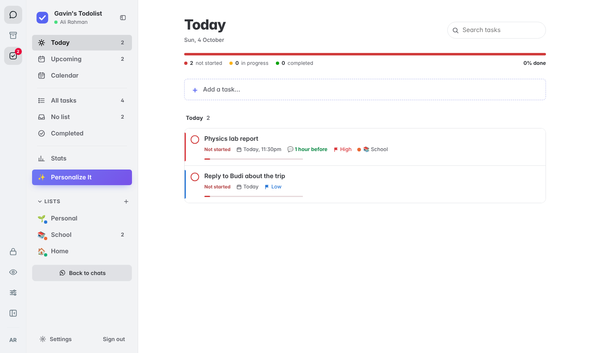

Since 2.0 the Todolist isn't a separate website any more: it lives **inside Whats Up**, at `/todo/` on the same address, served by the same server, signed in with the same account.

- In Whats Up, the **✓ button** on the left rail (top bar on phones, or **⋯ → ✓ Todolist**, or the <kbd>T</kbd> key) swaps your chats for your todolist. The **Whats Up logo** (💬) takes you back; on phones it is the button beside the menu, and <kbd>T</kbd> also swaps back. It loads once and then stays, so switching is instant. The red number on the button is what's due today.
- `/u/you/#todo` opens Whats Up straight into the todolist; `/todo/` opens it on its own (handy to install on a phone's home screen for notifications).
- Each person only ever sees **their own** tasks: the server picks your file from your Whats Up sign-in, never from anything the page sends.
- Whats Up admins (the `admin` login, or anyone marked as an admin) get the Todolist admin as a **✓ Todolist** tab on Whats Up's admin page.
- Whats Up's privacy keys keep working inside the todolist: <kbd>C</kbd> (panic) and <kbd>L</kbd> (lock), and the PIN lock covers it too.

## WhatsApp

| Feature | How |
| --- | --- |
| **Reminders on WhatsApp** | Settings → Notifications → *Also send my reminders to WhatsApp*. |
| **WhatsApp Buddy 🤖** | **💬 WhatsApp me** on any task, plus an optional morning brief and evening check-in. Settings → WhatsApp Buddy. |
| **Add tasks from WhatsApp** | Message Buddy `add buy milk tomorrow 5pm #shop` (or `todo: …` in “Message yourself”). |
| **Share a task** | Task details → **Send on WhatsApp** → pick one of your chats. Sent from your own WhatsApp. |

### WhatsApp Buddy 🤖 and the bot number

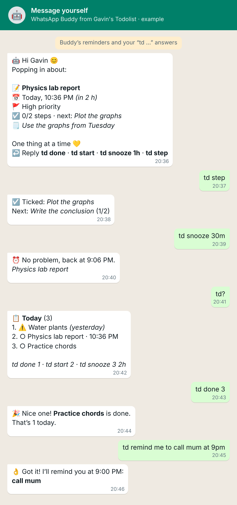

**With a bot number (recommended).** The admin links a **spare WhatsApp number** to its own Whats Up account (say `buddy`) and picks it in **Admin → ✓ Todolist → WhatsApp → Bot account**. Buddy then writes **from that number to each person's real WhatsApp number** (the one their Whats Up account is linked to), exactly like any other contact: phones buzz even when nobody has Whats Up open, and it works in the real WhatsApp app. People answer **right in that chat**, no prefix needed:

| You send Buddy | Buddy does |
| --- | --- |
| `today` (or `?`) | Today's open tasks (overdue first), numbered |
| `done` · `done 2` | Finishes the task it last reminded you about, or number 2 on its last list. A repeating task says when the next one is |
| `start` · `start 2` | Marks it in progress |
| `snooze` · `snooze 30m` · `2h` · `tonight` · `tomorrow` · `3pm` | Reminds you again then (plain `snooze` = in 1 hour) |
| `step` | Ticks the task's next step and tells you the one after |
| `move` | Moves today's unfinished (and overdue) tasks to tomorrow |
| `remind me to call mum at 8pm` | Adds the task with a WhatsApp reminder (a time that's already passed means tomorrow) |
| `add buy milk tomorrow 5pm` | Just adds a task |
| `delete 2` · `clear completed` | Deletes a numbered task, or all completed tasks |
| `clear reminders` | Cancels all task WhatsApp reminders and removes recent Buddy reminder/nudge messages |
| `clear buddy` | Removes recent messages Buddy sent |
| `help` · `hi` | The list of commands |

Buddy only answers numbers that belong to a Whats Up account, stays quiet for “thanks”/“ok”, and answers anything else with one short hint (at most once every 10 minutes). If the bot's phone is offline, messages fall back to the person's own “Message yourself” chat until it's back.

**Without a bot number.** Buddy writes into each person's own **“Message yourself”** chat, through their own WhatsApp (WhatsApp doesn't buzz for those). Answer there starting with `td`: `td?`, `td done`, `td snooze 1h`, `td add buy milk tomorrow 5pm`, `td delete 2`, `td clear reminders`, `td help`.

**When.** Buddy checks every 30 seconds. A reminder that comes due while the server is down is still sent if it's less than 12 hours late; a morning or evening message is sent up to 3 hours after its time, once a day. Each reminder goes out once; changing its time, or the task's date or time for a relative one, sets it again.

## Admin

On Whats Up's admin page, the **✓ Todolist** tab:

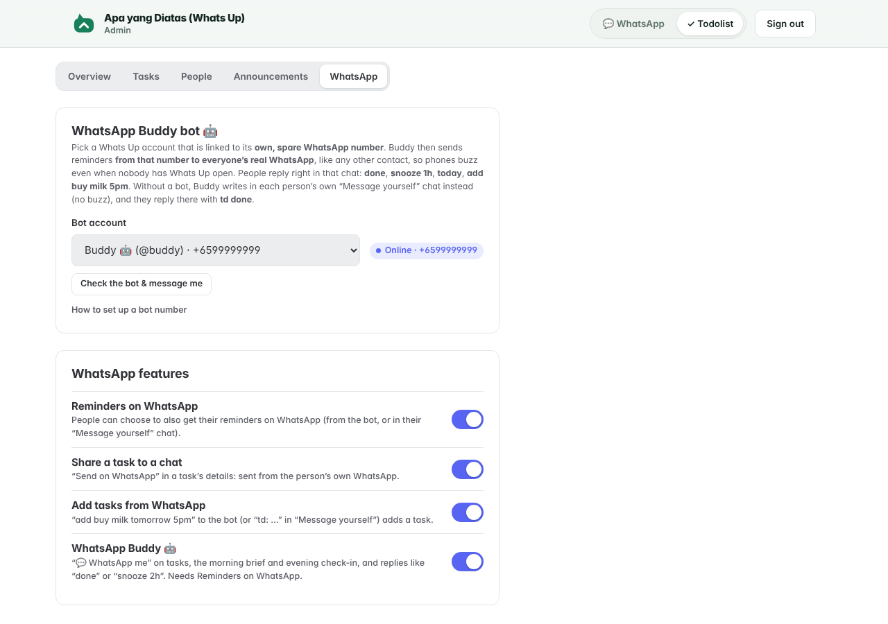

- **Overview**: the numbers at a glance, and how the tasks you gave are going.
- **Tasks**: give a task to everyone or to chosen people (optionally also on WhatsApp, from the bot), follow their progress live, nudge the ones who haven't finished, or take it back.
- **People & usage**: every Whats Up account, with open/overdue/done counts, last active, notifications, WhatsApp number, and quick actions (give a task, message them, show them the tutorial again). Task contents stay private: you only ever see counts, and the tasks you gave.
- **Announcements**: a notification plus an in-app banner to everyone or one person.
- **WhatsApp**: pick the **Buddy bot account** (with a step-by-step guide and a **Check the bot** button) and switch each WhatsApp feature on or off.

Tasks you give are stored in each person's own file like their other tasks, with a `from` marker that only the server can set. `/data/todo/assignments.json` remembers what was sent to whom.

## Notifications (reminders that pop up)

Reminders, tasks people give you, nudges and announcements arrive as normal phone and computer notifications (the notification bar on Android, Notification Center on Mac and iPhone, the Action Center on Windows), **even when the site is closed**, with the device's own notification sound. While Whats Up or the Todolist is open, a short **chime** plays too (Settings → Notifications → Sound, with ▶ Hear it).

1. Open the site from its **https** address (your Railway domain). Browsers only allow notifications on secure addresses.
2. **iPhone / iPad (iOS 16.4+):** in Safari open Whats Up, tap **Share → Add to Home Screen**, open **Whats Up** from the Home Screen and sign in. Apple only allows web notifications for apps on the Home Screen.
3. **Settings → Notifications → Turn on notifications**, allow it, then press **Send test notification**: it goes through the server and the push service to *this* device, exactly like a real reminder. If it says it was sent but nothing appears, the hint under it says where to look for your kind of device.
4. **Mac:** also allow your browser itself in **System Settings → Notifications → (Chrome / Safari / Edge…)**: Allow notifications, Banners or Alerts, Play sound. Focus / Do Not Disturb hides them.
5. Give a task a date and time. Its reminder is set to **At due time** automatically (change it with the 🔔 chip). Tapping the notification opens Whats Up on that task.

How it works: one service worker (`/todo/sw.js`) looks after the whole site, so the Whats Up page itself holds the subscription and hears reminders (devices set up before 3.1 are moved over automatically, no new prompt). Inside Whats Up the permission is asked by the Whats Up page, because Safari ignores it from the Todolist frame. Reminders stay on screen until you deal with them where the system allows it.

Keys for push (VAPID) are created on first start and saved in `/data/todo`; set `VAPID_PUBLIC_KEY` / `VAPID_PRIVATE_KEY` if you'd rather manage them yourself, and `VAPID_SUBJECT` to `mailto:you@example.com`.

## Deploy

Nothing separate to deploy: it's built and served by Whats Up's own Dockerfile (see the main README). Everything lives on Whats Up's volume, in `/data/todo/`.

### Variables (all optional)

| Variable | Default | |
| --- | --- | --- |
| `BOT_USER` | *(none)* | Lock the Buddy bot to this Whats Up username instead of choosing it in the admin page. |
| `TODO_BRAND` | `Gavin's Todolist` | Name used in WhatsApp messages. |
| `HOLIDAY_ICS_URL` | Google's public holiday calendars | Where holiday lists come from, with `{cal}` for the calendar name (e.g. `en.indonesian`). Cached in `/data/todo/holidays` for a day. |
| `VAPID_SUBJECT` | repo URL | Contact for push services, e.g. `mailto:you@example.com`. |
| `VAPID_PUBLIC_KEY` / `VAPID_PRIVATE_KEY` | generated | Push keys. Leave unset to have them made and saved to `/data/todo` automatically. |
| `REMINDER_TICK_MS` | `30000` | How often reminders are checked. |

## Develop locally

```bash
# in the repo root: Whats Up (needs its own npm install) on :8080
npm install && npm run dev
# in todo/: the page with hot reload on :5173/todo/ (talks to :8080)
cd todo && npm install && npm run dev
npm run build        # typecheck + build to todo/dist/ (Whats Up serves it at /todo/)
npm test             # repeat rules, holidays, day notes, Buddy, assignments…
```

## How it's built

| Part | What |
| --- | --- |
| `src/` | React 19 + TypeScript, built with Vite. `@dnd-kit` for drag and drop. No UI framework. |
| `src/ui.css` | Design system shared with Whats Up, so it all matches |
| `src/app.css` | The todolist layout |
| `server/app.js` | Mounted inside Whats Up's server at `/todo/`: the page, the JSON API and a live event stream (SSE). Who you are comes from the Whats Up cookie. Also hears WhatsApp messages for Buddy |
| `server/local.js` | The Todolist's way into WhatsApp: talks to the WhatsApp sessions running in the same process (status, chats, send) |
| `server/whatsapp.js` | Turning tasks into WhatsApp messages and `todo:` messages into tasks |
| `server/quickadd.js` | The "type naturally" parser, shared by the browser and the server |
| `server/store.js` | One JSON file per person in `/data/users/`, written atomically and validated on every change |
| `server/holidays.js` | Public holidays: downloads Google's holiday calendar (ICS) per country, caches it, with a built-in fallback |
| `src/appearance.ts` | Turns the Appearance settings into CSS colours, with readable text worked out automatically |
| `server/buddy.js` | WhatsApp Buddy: its personalities and messages, the 💬 reminders and morning/evening schedule, and the `td …` replies (tests in `buddy.test.js`) |
| `server/assign.js` | Tasks the admin gives people: what was sent to whom, and each person's progress (tests in `assign.test.js`) |
| `server/repeat.js` | Repeat rules (next date, descriptions), shared by the server and the browser; tests in `repeat.test.js` |

API (all under `/todo`, all JSON, all need the Whats Up sign-in cookie):
`GET /api/me` · `GET /api/badge` · `GET /api/data` · `GET /api/events` (SSE) ·
`POST /api/tasks` · `PATCH|DELETE /api/tasks/:id` · `POST /api/tasks/reorder` · `POST /api/tasks/clear-completed` ·
`POST /api/lists` · `PATCH|DELETE /api/lists/:id` · `POST /api/lists/reorder` · `PATCH /api/profile` ·
`GET /api/holidays?country=ID&from=2026&to=2027` · `PUT|DELETE /api/days/:date` (day notes) ·
`DELETE /api/lists/:id?tasks=delete` · `POST /api/lists/restore` (undo) · `PUT /api/board` (Personalize It)

`POST /api/buddy/test` (`{ kind: 'task' | 'morning' | 'evening' | 'help' }`) sends a WhatsApp Buddy example. A task's `wa` is `{ at: ms }` or `{ before: minutes }` (its `sent` is set by the server).

Admin only: `GET /api/admin/overview` · `GET /api/admin/people` · `GET|POST /api/admin/assignments` · `POST /api/admin/assignments/:id/remind` · `DELETE /api/admin/assignments/:id[?withdraw=1]` · `POST /api/admin/people/:username/tour` · `GET|POST /api/admin/settings` · `POST /api/admin/test` (check the bot) · `POST /api/admin/announce` · `DELETE /api/admin/announce/:id`

Every signed-in response has an `x-rev` header: the version of your data right after that request. The page uses it to tell its own saves apart from changes made on another device.

## Roadmap: ideas for later

- Export / import (CSV or JSON)
- A cute mascot for the empty screens

## Versioning

`MAJOR.MINOR.PATCH` in `package.json`, shown in Settings, plus the deployed commit. The WhatsApp app uses the same scheme.
